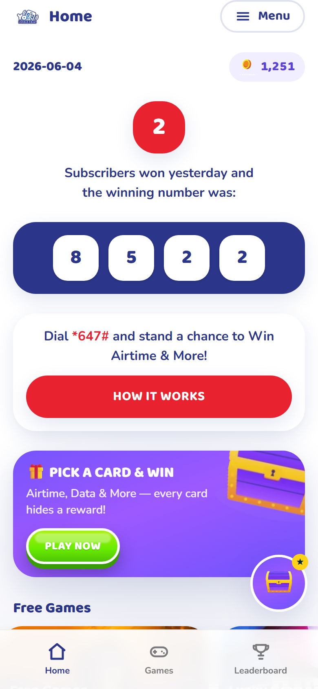
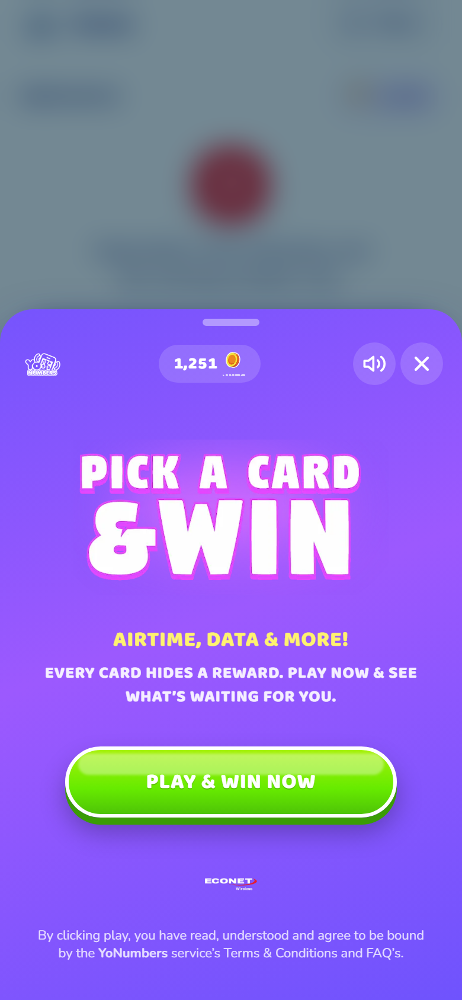
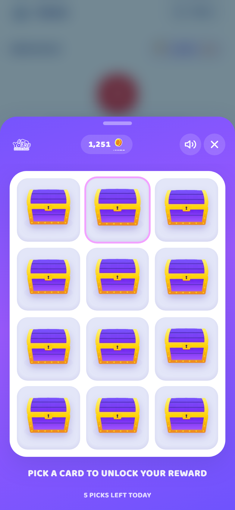
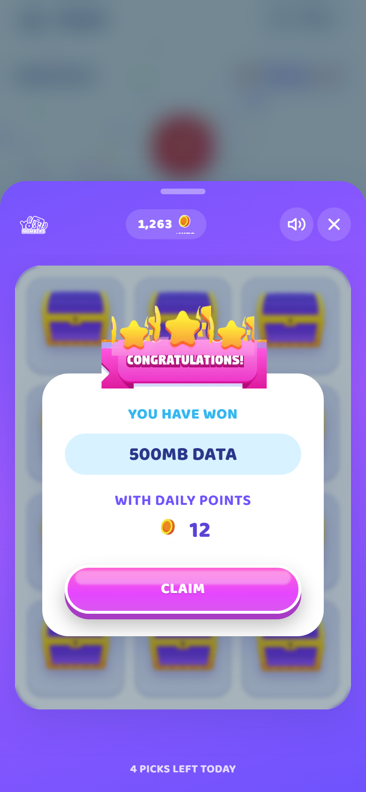
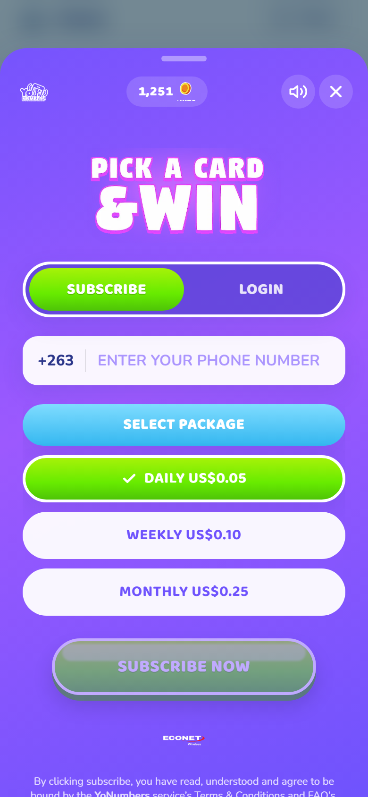
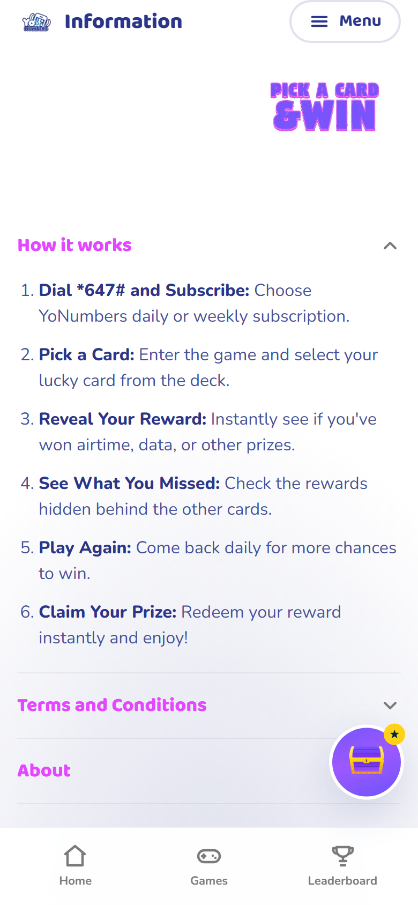
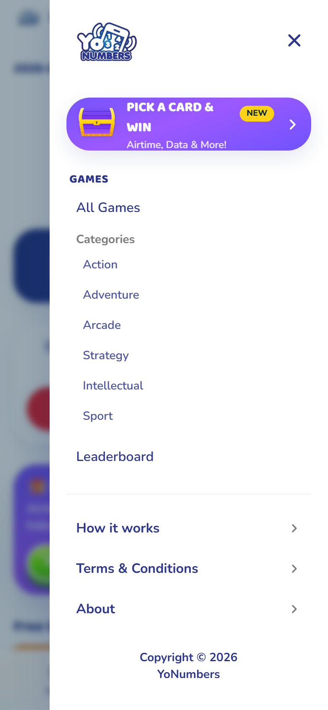
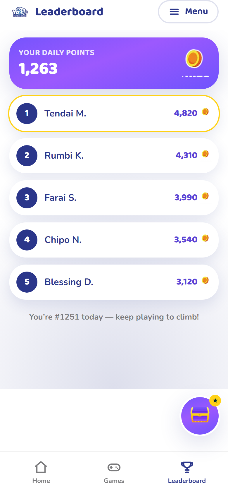

# YoNumbers — Pick a Card & Win

A production-grade, fully responsive, animated web experience for **YoNumbers by
Econet Wireless** (dial `*647#`). The signature **“Pick a Card & Win”** game is
built as a **portal-native pop-up engagement module** — it opens as an overlay on
top of the YoNumbers portal (no hard navigation), drops the user into a joyful,
gamified mini-game, and returns them exactly where they were.

> **Live:** _add your Vercel URL here after deploy_ → `https://<project>.vercel.app`

## Screens

| Portal Home | Pop-up Intro | Card Grid | Reward |
| --- | --- | --- | --- |
|  |  |  |  |

| Subscribe / Login | Information | Sidebar Menu | Leaderboard |
| --- | --- | --- | --- |
|  |  |  |  |

## What’s inside

- **Two coordinated themes** — a clean **Core** portal (navy + red, Nunito) and a
  vibrant **PickaCard** game world (purple gradient, candy buttons, gold chests,
  magenta lockup, Baloo 2).
- **Pick a Card as a pop-up overlay** — launched from three entry points (sidebar
  menu, Home promo card, floating chest launcher), all via a single
  `usePickACard()` controller. The host page stays mounted; the URL updates to
  `?pickacard=open` for back-button support.
- **Full in-overlay flow** — intro → subscribe/login → OTP → 3×4 chest grid →
  3D card flip → win/lose reward (confetti + staggered stars + ribbon) → return,
  with the daily-points count-up reflected on the Home badge.
- **Gamification** — daily play limit/cooldown, points economy, streaks, and
  configurable odds/prize tiers (all in the mock `gameService`).
- **Sound design** — a tiny synthesised `useSound()` layer (Web Audio, no asset
  files), default-on with a persisted mute toggle, never autoplaying before a
  user gesture.
- **Genuine brand assets** — every logo, the chest, coin, action-bar glyphs,
  stars, ribbons and OTP icons are the **actual artwork extracted from the
  supplied YoNumbers / Econet SVGs** (in `/public/brand` and `/public/img`).
  Gradients, candy-button shapes and panels are recreated in CSS.
- **Accessibility & polish** — focus-trapped, labelled dialog; ESC / backdrop /
  drag-down to close; keyboard-playable; reduced-motion honored throughout;
  safe-area insets; PWA manifest + icons.

## Tech stack

- **Next.js 14 (App Router) + TypeScript**
- **Tailwind CSS** with all design tokens in `tailwind.config.ts` + CSS variables
- **Framer Motion** for animation and transitions
- **canvas-confetti** for the win celebration
- Mock services in `/lib` (`gameService`, `otpService`, `pointsStore`) so a real
  API drops in later without touching the UI.

## Project structure

```
app/            routes: / (splash) · /home · /games · /leaderboard · /info
components/
  brand/        Logo, Lockup, Coin, EconetFooter (extracted assets)
  ui/           Button (candy + flat), PillToggle, PhoneInput, PackageSelector, OtpInput
  game/         TreasureCard, RewardPanel, GameTopBar, ActionBar, DailyPoints
  pickacard/    PickACardProvider (controller) · PickACardModal · Panels
  portal/       PortalChrome, SidebarMenu, BottomTabBar, FloatingLauncher, …
lib/            tokens/types, mock services, sound, haptics, confetti
public/brand/   extracted vector + logo PNGs
public/img/     extracted promo / free-games imagery
```

## Local development

```bash
npm install
npm run dev      # http://localhost:3000
npm run build    # production build
```

The OTP step accepts the dev code **`1234`** (see `lib/otpService.ts`).

---

YoNumbers and Econet Wireless brand assets © Econet Wireless. Built as a UI/UX
revamp of the supplied Figma designs.
